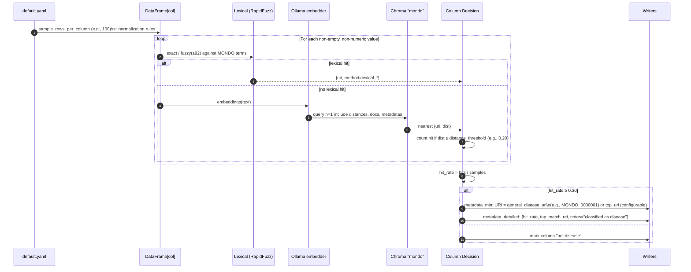

# Semantic Search Pipeline — Architecture
_Last updated: 2025-09-24_

This doc shows the full flow from MONDO ingestion → vector index → column scanning/tagging → outputs → visualization.

---

## 1) End-to-end components & data flow

```mermaid
flowchart LR
  subgraph Sources
    A1[MONDO_Trimmed.csv\n(full MONDO; Class ID, Preferred Label, Synonyms)]
    A2[Your CSVs\n(e.g., diseases_multi.csv,\nailments_multi.csv,...)]
    A3[configs/default.yaml\nthresholds, paths, model]
  end

  subgraph Ingestion
    B1[build_mondo_index.sh]
    B2[semantic_search/src/mondo_ingest.py\n• load CSV\n• dedup (uri,text)\n• batch & incremental get()/upsert()]
    B3[Ollama (local)\nmodel: nomic-embed-text\nembeddings(text)->vector]
  end

  subgraph Vector DB
    C1[Chroma PersistentClient\npath: semantic_search/chroma/]
    C2[(Collection: "mondo")\nids = URI::term\ndocuments = term text\nmetadatas = {uri, preferred_label, term_type}\nembeddings = vectors]
  end

  subgraph Scanning & Tagging
    D1[scan_columns.sh]
    D2[semantic_search/src/scan_columns.py\n• sample N per column\n• normalize/filter\n• lexical fallback (RapidFuzz)\n• embed + nearest in Chroma\n• hit_rate / decision]
  end

  subgraph Outputs
    E1[output/metadata_min.csv\nfile_name, column_name, URI, Synonym]
    E2[output/metadata_detailed.csv\nhit_rate, top_match_uri, notes]
  end

  subgraph Visualization (optional)
    F1[export_chroma.py → mondo_embeddings.parquet]
    F2[visualize_umap.py / _app.py\nUMAP→Plotly/Dash]
    F3[Nomic Atlas (optional)]
  end

  A1 --> B2
  B1 --> B2
  A3 --> B2
  B2 --> B3
  B3 --> C2
  C2 --> C1

  A2 --> D2
  A3 --> D2
  D1 --> D2
  D2 --> C2
  C2 --> D2

  D2 --> E1
  D2 --> E2

  C2 --> F1
  F1 --> F2
  F1 --> F3
```

---

## 2) Per-column decision (detailed sequence)



---

## 3) Swimlanes — Control Plane vs Data Plane

```mermaid
flowchart LR
  subgraph CP[Control Plane (orchestration)]
    CP1[default.yaml\n• paths, thresholds\n• model name]
    CP2[build_mondo_index.sh]
    CP3[semantic_search/src/mondo_ingest.py]
    CP4[scan_columns.sh]
    CP5[semantic_search/src/scan_columns.py]
    CP6[export_chroma.py / visualize_umap*.py\n(optional visualization)]
  end

  subgraph DP[Data Plane (compute & data)]
    DP1[MONDO_Trimmed.csv\n(full MONDO)\n(Class ID, Preferred Label, Synonyms)]
    DP2[Your CSVs\n(diseases_multi.csv,\nailments_multi.csv, ...)]
    DP3[[Ollama (local)\nmodel: nomic-embed-text]]
    DP4[[Chroma PersistentClient\npath: semantic_search/chroma/]]
    DP5[(Collection: "mondo")\nids = URI::term\ntext = term/synonym\nmeta = {uri,label,type}\nvec = embeddings]
    DP6[UMAP + Plotly/Dash\n(or Nomic Atlas)]
    DP7[Outputs\nmetadata_min.csv\nmetadata_detailed.csv]
  end

  CP1 --> CP2 --> CP3
  CP3 -->|embed terms| DP3 -->|vectors| DP5
  DP5 --> DP4

  CP1 --> CP4 --> CP5
  CP5 <-->|NN queries| DP5
  DP2 --> CP5
  CP5 --> DP7

  CP6 -->|reads| DP5
  DP5 --> DP6
  DP1 --> CP3
```

---

## 4) Deployment view (processes, ports, folders)

```mermaid
flowchart TB
  subgraph Host[Abhijit's iMac (macOS)]
    ZSH[Terminal (zsh)]
    VENV[(Python venv: chroma-env)]
    subgraph FS[/Project Filesystem/]
      DIRsrc[semantic_search/src/*\n(mondo_ingest.py, scan_columns.py,\nexport_chroma.py, visualize_*.\npy, utils.py, __init__.py)]
      DIRcfg[semantic_search/configs/default.yaml]
      DIRdata[semantic_search/data/\nMONDO_Trimmed.csv + your CSVs]
      DIRdb[semantic_search/chroma/\n(persisted Chroma index)]
      DIRout[semantic_search/output/\nmetadata_*.csv, mondo_embeddings.parquet,\numap HTML]
      DIRscripts[semantic_search/scripts/\n*.sh wrappers]
    end

    subgraph PROC[Processes]
      P1[[python -m ... mondo_ingest\n(ingestion)]]
      P2[[python -m ... scan_columns\n(scanning/tagging)]]
      P3[[python -m ... export/visualize\n(visualization)]]
      OLL[[Ollama server\nlocalhost:11434]]
      DASH[[Dash app (optional)\n127.0.0.1:8050]]
    end
  end

  ZSH -->|activates| VENV
  ZSH -->|runs| DIRscripts
  DIRscripts --> P1 & P2 & P3

  DIRcfg --> P1 & P2
  DIRdata --> P1 & P2
  P1 -->|embed terms| OLL
  P2 -->|embed samples| OLL

  P1 -->|upsert vectors| DIRdb
  P2 -->|query NN| DIRdb

  P2 -->|write CSVs| DIRout
  P3 -->|read vectors| DIRdb
  P3 -->|write HTML/Parquet| DIRout
  P3 --> DASH

  click OLL "https://github.com/ollama/ollama" "_blank"
```

---

## How to read each diagram

### 1) End-to-end components & data flow
- Big picture of everything: sources → ingestion → vector DB → scanning → outputs → (optional) visualization.
- Use it to explain the system to others and to trace data paths.

### 2) Per-column decision (detailed sequence)
- Shows exactly how a single column is classified:
  1) Sample values → clean/filter  
  2) Try **lexical** match (exact/fuzzy)  
  3) Else **embed** with Ollama → nearest in Chroma  
  4) Count hits → compute `hit_rate` → compare to threshold  
  5) Write to `metadata_min.csv` and `metadata_detailed.csv`
- Tune here:
  - `scan.distance_threshold` (semantic match strictness)
  - `hit_rate` cutoff (column-level decision)

### 3) Swimlanes — Control Plane vs Data Plane
- **Control plane**: scripts & configs that orchestrate runs (`*.sh`, `mondo_ingest.py`, `scan_columns.py`, visualizers).
- **Data plane**: heavy lifting (Ollama embeddings, Chroma storage/search, files).
- Use it to locate issues: config vs compute/storage.

### 4) Deployment view (processes, ports, folders)
- What runs where on your Mac:
  - Folders: `semantic_search/data`, `.../chroma`, `.../output`
  - Processes: Python modules
  - Ports: **Ollama 11434**, **Dash 8050** (optional)
- Use it for ops: backups/migration, port conflicts, cleanup.
